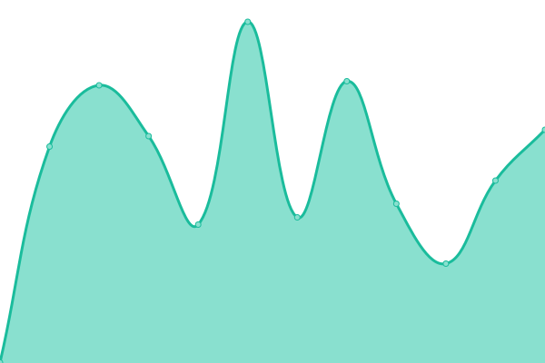

# [📈 Live Status](https://eldikra.github.io/monitoreo): <!--live status--> **🟧 Partial outage**

This repository contains the open-source uptime monitor and status page for [eldikra](https://eldikra.github.io/monitoreo), powered by [Upptime](https://github.com/upptime/upptime).

With [Upptime](https://upptime.js.org), you can get your own unlimited and free uptime monitor and status page, powered entirely by a GitHub repository. We use [Issues](https://github.com/eldikra/monitoreo/issues) as incident reports, [Actions](https://github.com/eldikra/monitoreo/actions) as uptime monitors, and [Pages](https://eldikra.github.io/monitoreo) for the status page.

<!--start: status pages-->
<!-- This summary is generated by Upptime (https://github.com/upptime/upptime) -->
<!-- Do not edit this manually, your changes will be overwritten -->
<!-- prettier-ignore -->
| URL | Status | History | Response Time | Uptime |
| --- | ------ | ------- | ------------- | ------ |
|  [Google](https://www.google.com) | 🟩 Up | [google.yml](https://github.com/eldikra/monitoreo/commits/HEAD/history/google.yml) | 

 100ms
     
 | 

<a href="https://eldikra.github.io/monitoreo/history/google">100.00%</a>
    

|  [101SI](https://www.101si.com.ar) | 🟥 Down | [101-si.yml](https://github.com/eldikra/monitoreo/commits/HEAD/history/101-si.yml) | 

 0ms
     
 | 

<a href="https://eldikra.github.io/monitoreo/history/101-si">0.00%</a>
    

|  [Instagram](https://www.instagram.com) | 🟩 Up | [instagram.yml](https://github.com/eldikra/monitoreo/commits/HEAD/history/instagram.yml) | 

 506ms
     
 | 

<a href="https://eldikra.github.io/monitoreo/history/instagram">99.84%</a>
    

|  [Banco Provincia](https://www.bancoprovincia.com.ar/home/) | 🟩 Up | [banco-provincia.yml](https://github.com/eldikra/monitoreo/commits/HEAD/history/banco-provincia.yml) | 

 1309ms
     
 | 

<a href="https://eldikra.github.io/monitoreo/history/banco-provincia">100.00%</a>
    

|  [BIP](https://www.bancoprovincia.bancainternet.com.ar/spa/) | 🟩 Up | [bip.yml](https://github.com/eldikra/monitoreo/commits/HEAD/history/bip.yml) | 

 979ms
     
 | 

<a href="https://eldikra.github.io/monitoreo/history/bip">100.00%</a>
    

<!--end: status pages-->

[**Visit our status website →**](https://eldikra.github.io/monitoreo)

## 📄 License

- Powered by: [Upptime](https://github.com/upptime/upptime)
- Code: [MIT](./LICENSE) © [eldikra](https://eldikra.github.io/monitoreo)
- Data in the `./history` directory: [Open Database License](https://opendatacommons.org/licenses/odbl/1-0/)
